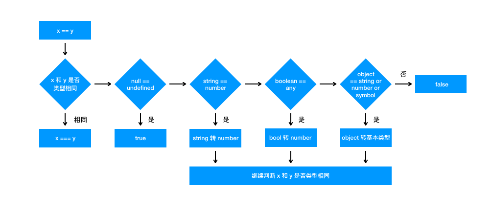

### 一、 数据类型

##### 1. JavaScript有几种数据类型，它们的区别？

JavaScript共有八种数据类型，分别是：

- 原始数据类型：`Number`、`String`、`Boolean`、`undefined`、`null`、`Symbol `和 `BigInt`
- 引用数据类型： `Object`（普通对象Object，数组对象Array，日期对象Date，函数对象Function，数学对象Math，正则对象RegExp）


两种数据类型的区别在于存放位置的不同（创建对象成本比较大，所以引用同一份数据能节省性能）：

- 原始数据类型是直接存储在栈中的简单数据段，占据空间小、大小固定，属于被频繁使用的数据，所以放入栈中存储。
- 引用数据类型是存储在堆中的对象，占据空间大，大小不固定。引用数据类型实际在栈中存放的是指针，指针指向堆中该实体存放的起始地址。当解释器寻找引用值时，会先在栈中寻找指针，再到堆中寻找实体。

##### 2. 数据类型检测的方式有哪些

(1) `typeof`：null，数组和对象都会被判断为`object`

```js
console.log(typeof 2);						// number
console.log(typeof 'str');					// string
console.log(typeof true);					// boolean
console.log(typeof {});						// object
console.log(typeof []);						// object
console.log(typeof null);					// object
console.log(typeof function () {});			// function
console.log(typeof undefined);				// undefined
```

(2) `instanceof`： 只能正确判断引用类型

```js
console.log(2 instanceof Number);				// false
console.log('str' instanceof String);			// false
console.log(true instanceof Boolean);			// false

console.log([] instanceof Array);				// true，function Array() {}
console.log(function(){} instanceof Function);	// true，function Function() {}
console.log({} instanceof Object);				// true，function Object() {}
```

(3) `constructor`： 有两个作用，一是判断数据的类型，二是对象实例通过 `constructor` 对象访问它的构造函数。需要注意，如果创建一个对象来改变它的原型，`constructor`就不能用来判断数据类型了。该方法只能判断引用数据类型。

```js
function Fn(){};
 
Fn.prototype = new Array();	// 改变Fn的prototype指向
 
var f = new Fn();	// 返回的实例__proto__指向上面创建的数组，它的constructor为[]的constructor，即Array.prototype.constructor（Array）
 
console.log(f.constructor === Fn);    // false
console.log(f.constructor === Array); // true
```

(4) `Object.prototype.toString.call()`

```js
var toString = Object.prototype.toString;
 
console.log(toString.call(2));				// [object Number]
console.log(toString.call(true));			// [object Boolean]
console.log(toString.call('str'));			// [object String]
console.log(toString.call([]));				// [object Array]
console.log(toString.call(function(){}));	// [object Function]
console.log(toString.call({}));				// [object Object]
console.log(toString.call(undefined));		// [object Undefined]
console.log(toString.call(null));			// [object Null]
```

##### 3.  判断数组的方式有哪些

- `Object.prototype.toString.call([]) === '[object Array]'`
- `Array.isArray([])`
- `[] instanceof Array`
- `[].constructor === Array`

##### 4. null和undefined区别

null表示空对象，undefined表示未定义，用双等号"=="比较时会返回true

##### 5. typeof null 的结果是什么，为什么？

`typof null` 的结果是 object，但它并不是空对象。之所以这样是因为初始版本的JS，兼容32位操作系统，用3位长度表示类型，其中`000`表示`object`，而null表示为全0，存在误判。

##### 6. intanceof 操作符的实现原理及实现

instanceof 运算符用于判断构造函数的 prototype 属性是否出现在对象的原型链中的任何位置。

```js
function myInstanceof (left, right) {
  if (typeof left !== 'object' || left === null) return false;
  let proto = Object.getPrototypeOf(left);
  const prototype = right.prototype;
  while (true) {
    if (proto === null) return false;
    if (proto === prototype) return true;
    proto = Object.getPrototypeOf(proto);
  }
}
```

##### 7. 为什么0.1+0.2 ! == 0.3，如何让其相等

由于计算机计算是通过二进制的，JavaScript使用64位来表示数字，其中1位符号位，11位指数位，52位小数位。在转换时会舍0取1，而0.1的二进制是：`0.0001100110011001100...`（1100循环），0.2的二进制是：`0.00110011001100...`（1100循环），两个数相加，保留52位再转换为十进制会存在误差。

解决方法：

- 保留需要的小数位：`(0.1 + 0.2).toFixed(1) == 0.3`
- 判断是否在误差范围内：`(0.1 + 0.2) - 0.3 < Number.EPSILON`

##### 8. typeof NaN 的结果是什么？

NaN 指“不是一个数字”（not a number），NaN 是一个“警戒值”（sentinel value，有特殊用途的常规值），用于指出数字类型中的错误情况，即“执行数学运算没有成功，这是失败后返回的结果”。

```
typeof NaN; // "number"
```

NaN 是一个特殊值，它和自身不相等，是唯一一个非自反（自反，reflexive，即 `x === x` 不成立）的值。而 `NaN !== NaN` 为 true。

##### 9. isNaN 和 Number.isNaN 函数的区别？

- isNaN 会先进行类型转换，不能被转为为数值的值会返回true，因此其他类型的值也会返回true，造成误差
- Number.isNaN 会先判断是否是一个数字，再进行判断是否是NaN，只有当参数为NaN时才会返回true

##### 10. ==操作符的强制类型转换规则



(1) 判断类型是否相同，相同则直接进行比较

(2) 判断是否是null和undefined的比较，是则返回true

(3) 判断是否是number和string的比较，是则将string转换为number类型进行比较

(4) 判断是否包含boolean值，是则将boolean转换为number进行比较(true -> 1，false -> 0)，进行比较

(5) 判断是否是对象和number、string或symbol进行比较，是则将对象转换为原始类型'[object Object]'，进行比较

(6) 若上述判断都不生效，直接返回false

##### 11. 其他值到字符串的转换规则？

- Null 和 Undefined 类型 ，null 转换为 "null"，undefined 转换为 "undefined"，
- Boolean 类型，true 转换为 "true"，false 转换为 "false"。
- Number 类型的值直接转换，不过那些极小和极大的数字会使用指数形式。
- Symbol 类型的值直接转换，但是只允许显式强制类型转换，使用隐式强制类型转换会产生错误。
- 对普通对象来说，除非自行定义 toString() 方法，否则会调用 toString()（Object.prototype.toString()）来返回内部属性 [[Class]] 的值，如"[object Object]"。如果对象有自己的 toString() 方法，字符串化时就会调用该方法并使用其返回值。

##### 12. 其他值到数字值的转换规则？

- Undefined 类型的值转换为 NaN。
- Null 类型的值转换为 0。
- Boolean 类型的值，true 转换为 1，false 转换为 0。
- String 类型的值转换如同使用 Number() 函数进行转换，如果包含非数字值则转换为 NaN，空字符串为 0。
- Symbol 类型的值不能转换为数字，会报错。
- 对象（包括数组）会首先被转换为相应的基本类型值，如果返回的是非数字的基本类型值，则再遵循以上规则将其强制转换为数字。

为了将值转换为相应的基本类型值，抽象操作 ToPrimitive 会首先（通过内部操作 DefaultValue）检查该值是否有valueOf()方法。如果有并且返回基本类型值，就使用该值进行强制类型转换。如果没有就使用 toString() 的返回值（如果存在）来进行强制类型转换。

如果 valueOf() 和 toString() 均不返回基本类型值，会产生 TypeError 错误。

##### 13. 其他值到布尔类型的值的转换规则？

以下这些是假值：

• undefined

• null

• false

• +0、-0 和 NaN

• ""

假值的布尔强制类型转换结果为 false。从逻辑上说，假值列表以外的都应该是真值。

##### 14. || 和 && 操作符的返回值？

|| 和 && 首先会对第一个操作数执行条件判断，如果其不是布尔值就先强制转换为布尔类型，然后再执行条件判断。

- 对于 || 来说，如果条件判断结果为 true 就返回第一个操作数的值，如果为 false 就返回第二个操作数的值。
- && 则相反，如果条件判断结果为 true 就返回第二个操作数的值，如果为 false 就返回第一个操作数的值。

|| 和 && 返回它们其中一个操作数的值，而非条件判断的结果

##### 15. Object.is() 与比较操作符 “`===`”、“`==`” 的区别？

- 使用双等号（==）进行相等判断时，如果两边的类型不一致，则会进行强制类型转化后再进行比较。
- 使用三等号（===）进行相等判断时，如果两边的类型不一致时，不会做强制类型准换，直接返回 false。
- 使用 Object.is 来进行相等判断时，一般情况下和三等号的判断相同，它处理了一些特殊的情况，比如 -0 和 +0 不再相等，两个 NaN 是相等的。

##### 16. JavaScript中如何进行隐式类型转换

首先要介绍`ToPrimitive`方法，这是 JavaScript 中每个值隐含的自带的方法，用来将值 （无论是基本类型值还是对象）转换为基本类型值。如果值为基本类型，则直接返回值本身；如果值为对象，其看起来大概是这样：

```js
/**
* @obj 需要转换的对象
* @type 期望的结果类型
*/
ToPrimitive(obj,type)
```

`type`的值为`number`或者`string`。

**（1）当**`type`**为**`number`**时规则如下：**

- 调用`obj`的`valueOf`方法，如果为原始值，则返回，否则下一步；
- 调用`obj`的`toString`方法，后续同上；
- 抛出`TypeError` 异常。

**（2）当**`type`**为**`string`**时规则如下：**

- 调用`obj`的`toString`方法，如果为原始值，则返回，否则下一步；
- 调用`obj`的`valueOf`方法，后续同上；
- 抛出`TypeError` 异常。

可以看出两者的主要区别在于调用`toString`和`valueOf`的先后顺序。默认情况下：

- 如果对象为 Date 对象，则`type`默认为`string`；
- 其他情况下，`type`默认为`number`。

总结上面的规则，对于 Date 以外的对象，转换为基本类型的大概规则可以概括为一个函数：

```js
var objToNumber = value => Number(value.valueOf().toString())
objToNumber([]) === 0
objToNumber({}) === NaN
```

而 JavaScript 中的隐式类型转换主要发生在`+、-、*、/`以及`==、>、<`这些运算符之间。而这些运算符只能操作基本类型值，所以在进行这些运算前的第一步就是将两边的值用`ToPrimitive`转换成基本类型，再进行操作。

以下是基本类型的值在不同操作符的情况下隐式转换的规则 （对于对象，其会被`ToPrimitive`转换成基本类型，所以最终还是要应用基本类型转换规则）：

1. +操作符`+`操作符的两边有至少一个`string`类型变量时，两边的变量都会被隐式转换为字符串；其他情况下两边的变量都会被转换为数字。

```js
1 + '23' // '123'
 1 + false // 1 
 1 + Symbol() // Uncaught TypeError: Cannot convert a Symbol value to a number
 '1' + false // '1false'
 false + true // 1
```

1. -、*、\操作符NaN也是一个数字

```js
1 * '23' // 23
 1 * false // 0
 1 / 'aa' // NaN
```

1. 对于**`==`**操作符

操作符两边的值都尽量转成`number`：

```js
3 == true // false, 3 转为number为3，true转为number为1
'0' == false //true, '0'转为number为0，false转为number为0
'0' == 0 // '0'转为number为0
```

1. 对于**`<`**和**`>`**比较符

如果两边都是字符串，则比较字母表顺序：

```js
'ca' < 'bd' // false
'a' < 'b' // true
```

其他情况下，转换为数字再比较：

```js
'12' < 13 // true
false > -1 // true
```

以上说的是基本类型的隐式转换，而对象会被`ToPrimitive`转换为基本类型再进行转换：

```js
var a = {}
a > 2 // false
```

其对比过程如下：

```js
a.valueOf() // {}, 上面提到过，ToPrimitive默认type为number，所以先valueOf，结果还是个对象，下一步
a.toString() // "[object Object]"，现在是一个字符串了
Number(a.toString()) // NaN，根据上面 < 和 > 操作符的规则，要转换成数字
NaN > 2 //false，得出比较结果
```

又比如：

```js
var a = {name:'Jack'}
var b = {age: 18}
a + b // "[object Object][object Object]"
```

运算过程如下：

```js
a.valueOf() // {}，上面提到过，ToPrimitive默认type为number，所以先valueOf，结果还是个对象，下一步
a.toString() // "[object Object]"
b.valueOf() // 同理
b.toString() // "[object Object]"
a + b // "[object Object][object Object]"
```

### 二、ES6

##### 1. let、const、var的区别

**（1）块级作用域：**块作用域由 `{ }`包括，let和const具有块级作用域，var不存在块级作用域。块级作用域解决了ES5中的两个问题：

- 内层变量可能覆盖外层变量
- 用来计数的循环变量泄露为全局变量

**（2）变量提升：**var存在变量提升，let和const不存在变量提升，即在变量只能在声明之后使用，否在会报错。

**（3）给全局添加属性：**浏览器的全局对象是window，Node的全局对象是global。var声明的变量为全局变量，并且会将该变量添加为全局对象的属性，但是let和const不会。

**（4）重复声明：**var声明变量时，可以重复声明变量，后声明的同名变量会覆盖之前声明的遍历。const和let不允许重复声明变量。

**（5）暂时性死区：在使用let、const命令声明变量之前，该变量都是不可用的。这在语法上，称为暂时性死区**。使用var声明的变量不存在暂时性死区。

**（6）初始值设置：**在变量声明时，var 和 let 可以不用设置初始值。而const声明变量必须设置初始值。

**（7）指针指向：**let和const都是ES6新增的用于创建变量的语法。 let创建的变量是可以更改指针指向（可以重新赋值）。但const声明的变量是不允许改变指针的指向。

| **区别**    | **var** | **let** | **const** |
| --------- | ------- | ------- | --------- |
| 是否有块级作用域  | ×       | ✔️      | ✔️        |
| 是否存在变量提升  | ✔️      | ×       | ×         |
| 是否添加全局属性  | ✔️      | ×       | ×         |
| 能否重复声明变量  | ✔️      | ×       | ×         |
| 是否存在暂时性死区 | ×       | ✔️      | ✔️        |
| 是否必须设置初始值 | ×       | ×       | ✔️        |
| 能否改变指针指向  | ✔️      | ✔️      | ×         |

##### 2. const对象的属性可以修改吗 

const保证的并不是变量的值不能改动，而是变量指向的那个内存地址不能改动。对于基本类型的数据（数值、字符串、布尔值），其值就保存在变量指向的那个内存地址，因此等同于常量。

但对于引用类型的数据（主要是对象和数组）来说，变量指向数据的内存地址，保存的只是一个指针，const只能保证这个指针是固定不变的，至于它指向的数据结构是不是可变的，就完全不能控制了。

##### 3. 如果new一个箭头函数的会怎么样

箭头函数是ES6中的提出来的，它没有prototype，也没有自己的this指向，更不可以使用arguments参数，所以不能New一个箭头函数。

new 操作符的实现步骤如下：

1. 创建一个对象
2. 将构造函数的作用域赋给新对象（即对象的`__proto__`指向构造函数的`prototype`）
3. 执行构造函数，同时把构造函数的this指向该对象
4. 判断构造函数是否返回对象，是则返回构造函数的返回值，否则返回创建的新对象

以上2、3步箭头函数无法执行

##### 4. 箭头函数与普通函数的区别

**（1）箭头函数比普通函数更加简洁**

- 如果没有参数，就直接写一个空括号即可
- 如果只有一个参数，可以省去参数的括号
- 如果有多个参数，用逗号分割
- 如果函数体的返回值只有一句，可以省略大括号
- 如果函数体不需要返回值，且只有一句话，可以给这个语句前面加一个void关键字。最常见的就是调用一个函数：

```
let fn = () => void doesNotReturn();
```

**（2）箭头函数没有自己的this**

箭头函数不会创建自己的this， 所以它没有自己的this，它只会在自己作用域的上一层继承this。所以箭头函数中this的指向在它在定义时已经确定了，之后不会改变。

**（3）箭头函数继承来的this指向永远不会改变**

```
var id = 'GLOBAL';
var obj = {
  id: 'OBJ',
  a: function(){
    console.log(this.id);
  },
  b: () => {
    console.log(this.id);
  }
};
obj.a();    // 'OBJ'
obj.b();    // 'GLOBAL'
new obj.a()  // undefined
new obj.b()  // Uncaught TypeError: obj.b is not a constructor
```

对象obj的方法b是使用箭头函数定义的，这个函数中的this就永远指向它定义时所处的全局执行环境中的this，即便这个函数是作为对象obj的方法调用，this依旧指向Window对象。需要注意，定义对象的大括号`{}`是无法形成一个单独的执行环境的，它依旧是处于全局执行环境中。

**（4）call()、apply()、bind()等方法不能改变箭头函数中this的指向**

```
var id = 'Global';
let fun1 = () => {
    console.log(this.id)
};
fun1();                     // 'Global'
fun1.call({id: 'Obj'});     // 'Global'
fun1.apply({id: 'Obj'});    // 'Global'
fun1.bind({id: 'Obj'})();   // 'Global'
```

**（5）箭头函数不能作为构造函数使用**

构造函数在new的步骤在上面已经说过了，实际上第二步就是将函数中的this指向该对象。 但是由于箭头函数时没有自己的this的，且this指向外层的执行环境，且不能改变指向，所以不能当做构造函数使用。

**（6）箭头函数没有自己的arguments**

箭头函数没有自己的arguments对象。在箭头函数中访问arguments实际上获得的是它外层函数的arguments值。

**（7）箭头函数没有prototype**

**（8）箭头函数不能用作Generator函数，不能使用yeild关键字**

##### 5. 箭头函数的this指向哪里？

箭头函数不同于传统JavaScript中的函数，箭头函数并没有属于⾃⼰的this，它所谓的this是捕获其所在上下⽂的 this 值，作为⾃⼰的 this 值，并且由于没有属于⾃⼰的this，所以是不会被new调⽤的，这个所谓的this也不会被改变。

可以⽤Babel理解⼀下箭头函数:

```js
// ES6 
const obj = { 
  getArrow() { 
    return () => { 
      console.log(this === obj); 
    }; 
  } 
}
```

转化后：

```js
// ES5，由 Babel 转译
var obj = { 
   getArrow: function getArrow() { 
     var _this = this; 
     return function () { 
        console.log(_this === obj); 
     }; 
   } 
};
```

##### 6. 扩展运算符的作用及使用场景

**（1）对象扩展运算符**

对象的扩展运算符(...)用于取出参数对象中的所有可遍历属性，拷贝到当前对象之中。

```js
let bar = { a: 1, b: 2 };
let baz = { ...bar }; // { a: 1, b: 2 }
```

上述方法实际上等价于:

```js
let bar = { a: 1, b: 2 };
let baz = Object.assign({}, bar); // { a: 1, b: 2 }
```

`Object.assign`方法用于对象的合并，将源对象`（source）`的所有可枚举属性，复制到目标对象`（target）`。`Object.assign`方法的第一个参数是目标对象，后面的参数都是源对象。(**如果目标对象与源对象有同名属性，或多个源对象有同名属性，则后面的属性会覆盖前面的属性**)。

同样，如果用户自定义的属性，放在扩展运算符后面，则扩展运算符内部的同名属性会被覆盖掉。

```js
let bar = {a: 1, b: 2};
let baz = {...bar, ...{a:2, b: 4}};  // {a: 2, b: 4}
```

利用上述特性就可以很方便的修改对象的部分属性。在`redux`中的`reducer`函数规定必须是**一个纯函数**，`reducer`中的`state`对象要求不能直接修改，可以通过扩展运算符把修改路径的对象都复制一遍，然后产生一个新的对象返回。

需要注意：**扩展运算符对\****对象实例的拷贝属于浅拷贝**。

**（2）数组扩展运算符**

数组的扩展运算符可以将一个数组转为用逗号分隔的参数序列，且每次只能展开一层数组。

```js
console.log(...[1, 2, 3])
// 1 2 3
console.log(...[1, [2, 3, 4], 5])
// 1 [2, 3, 4] 5
```

下面是数组的扩展运算符的应用：

- **将数组转换为参数序列**

```js
function add(x, y) {
  return x + y;
}
const numbers = [1, 2];
add(...numbers) // 3
```

- **复制数组**

```js
const arr1 = [1, 2];
const arr2 = [...arr1];
```

- **合并数组**

如果想在数组内合并数组，可以这样：

```js
const arr1 = ['two', 'three'];
const arr2 = ['one', ...arr1, 'four', 'five'];
// ["one", "two", "three", "four", "five"]
```

- **扩展运算符与解构赋值结合起来，用于生成数组**

```js
const [first, ...rest] = [1, 2, 3, 4, 5];
first // 1
rest  // [2, 3, 4, 5]
```

需要注意：**如果将扩展运算符用于数组赋值，只能放在参数的最后一位，否则会报错。**

```js
const [...rest, last] = [1, 2, 3, 4, 5];         // 报错
const [first, ...rest, last] = [1, 2, 3, 4, 5];  // 报错
```

- **将字符串转为真正的数组**

```js
[...'hello']    // [ "h", "e", "l", "l", "o" ]
```

- **任何 Iterator 接口的对象，都可以用扩展运算符转为真正的数组**

比较常见的应用是可以将某些数据结构转为数组：

```js
// arguments对象
function foo() {
  const args = [...arguments];
}
```

用于替换`es5`中的`Array.prototype.slice.call(arguments)`写法。

- **使用**`Math`**函数获取数组中特定的值**

```js
const numbers = [9, 4, 7, 1];
Math.min(...numbers); // 1
Math.max(...numbers); // 9
```

##### 7. Proxy 可以实现什么功能？

